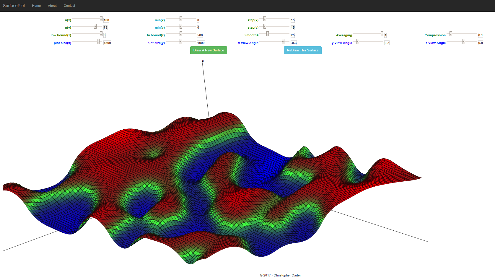

# SurfacePlot
<h1> Description</h1> 
A <b>data visualization</b> tool which creates random three-dimensional surfaces with user-defined parameters, 
then plots them in rotatable and zoomable 3-space. 
 

 
&copy; Christopher Carter 2018
